# Weak supervised 3D Object Detection
Based on the Omni3D dataset & Cube R-CNN model 
[[`Project Page`](https://garrickbrazil.com/omni3d)] [[`arXiv`](https://arxiv.org/abs/2207.10660)] [[`BibTeX`](#citing)]

This is the code accompanying our thesis which focuses on weakly-supervised 3D object detection, extinguishing the need for such data. By specifically investigating monocular methods, we leverage the high accessibility of single-camera systems over costly LiDAR sensors or complex multi-camera setups. We create three methods using 2D box annotations: A **proposal-and-scoring method**, a **pseudo-ground-truth method**, and a **weak Cube R-CNN**. The proposal method generates 1000 cubes per object and scores them. The prediction of this method is used as a pseudo ground truth in the [[`Cube R-CNN framework`](https://garrickbrazil.com/omni3d)]. To create a weak Cube RCNN, we modify the framework by replacing its 3D loss functions with ones based solely on 2D annotations. Our methods rely heavily on external, strong generalised deep learning models to infer spatial information in scenes. Experimental results show that all models perform comparably to an annotation time-equalised Cube R-CNN, whereof the pseudo ground truth method achieves the highest accuracy. The results show the methods’ ability to understand scenes in 3D, providing satisfactory visual results. Although not precise enough for centimetre accurate measurements, the methods provide a solid foundation for further research.

# Brief outline of method
We use rely heavily on the [Depth Anything]([github.com/](https://github.com/LiheYoung/Depth-Anything)) for processing the depth of images. An example of which can be seen below. 
<p align="center">
  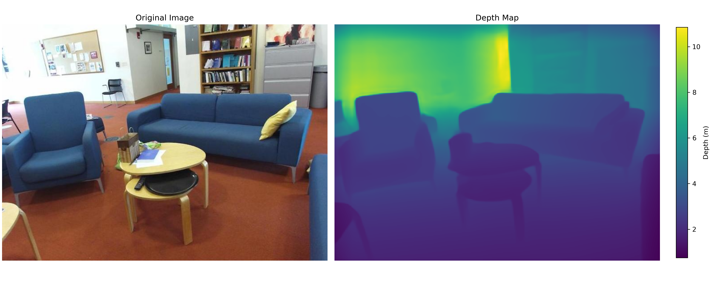
</p>
We interpret the depth maps as point clouds like the one below. This enables us to identify the ground and determine which way is up in images.
<p align="center">
  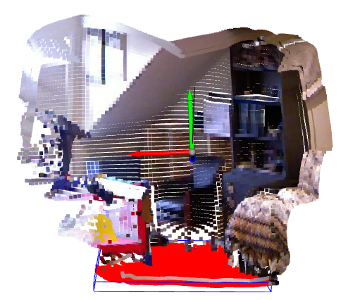
</p>

# Example results
<table style="border-collapse: collapse; border: none;">
<tr>
	<td width="60%">
		<p align="center">
			Proposal method
			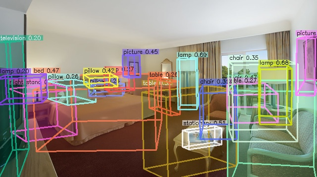
		</p>
	</td>
	<td width="35%">
		<p align="center">
			Top view
			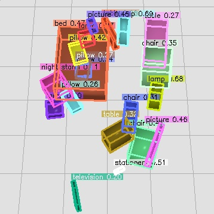
		</p>
	</td>
</tr>
</table>
<table style="border-collapse: collapse; border: none;">
<tr>
	<td width="60%">
		<p align="center">
			Pseudo ground truth method
			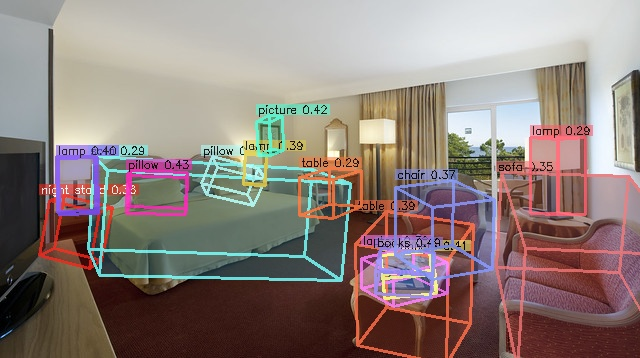
		</p>
	</td>
	<td width="35%">
		<p align="center">
			Top view
			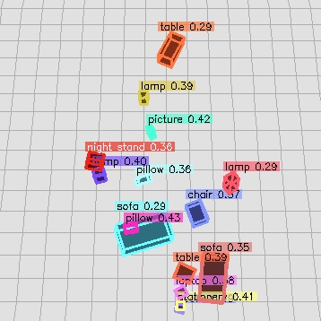
		</p>
	</td>
</tr>
</table>
<table style="border-collapse: collapse; border: none;">
<tr>
	<td width="60%">
		<p align="center">
			Weak Cube R-CNN
			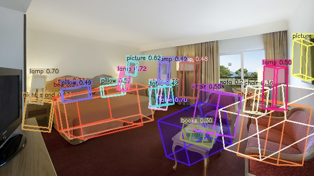
		</p>
	</td>
	<td width="35%">
		<p align="center">
			Top view
			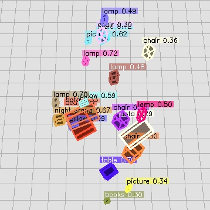
		</p>
	</td>
</tr>
</table>
<table style="border-collapse: collapse; border: none;">
<tr>
	<td width="60%">
		<p align="center">
			Time equalised Cube R-CNN
			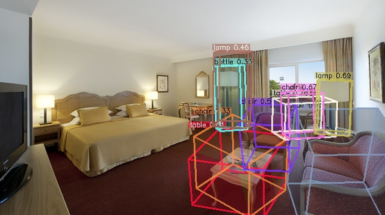
		</p>
	</td>
	<td width="35%">
		<p align="center">
			Top view
			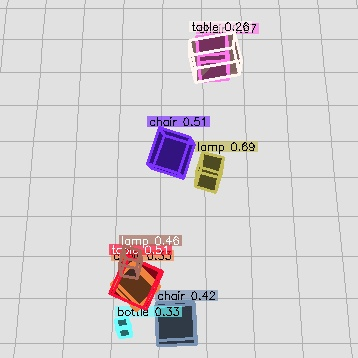
		</p>
	</td>
</tr>
</table>
<table style="border-collapse: collapse; border: none;">
<tr>
	<td width="60%">
		<p align="center">
			Standard (benchmark) Cube R-CNN
			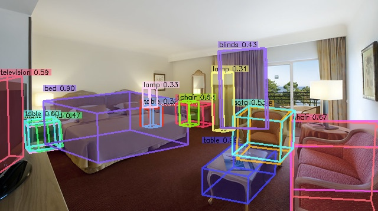
		</p>
	</td>
	<td width="35%">
		<p align="center">
			Top view
			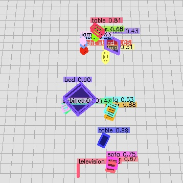
		</p>
	</td>
</tr>
</table>


# Updated results
We found some weird inconsistencies in our testing, namely the postprocessing of the 2D box predictions was missing for the proposal method. After rerunning the models, the results are as follows.

| | **AP2D**    | **AP3D**    | **AP3D@15** | **AP3D@25**   | **AP3D@50**   |
|-----|----:|----:|----:|----:|----:|
| Proposal method | 8.26 | 5.68 | 9.31  | 5.37 | 0.24 |
| Pseudo GT | 10.23 | **6.47** | **10.83** | **6.74** | 0.37 |
| Weak Cube R-CNN | **12.62** | 4.88 | 8.44 | 3.77 | 0.06 |
| Time-equalised Cube R-CNN | 3.89 | 3.27 | 5.30 | 3.28 | **0.39** |
| Cube R-CNN | 16.51 | 15.08 | 21.34   | 16.2   | 4.56 |

# How the code works
All the models are defined in the different config files. The config files define different meta architectures and ROI heads. A meta architecture is the overall model, while the ROI head is the part doing the processing for each Region of interest. In theory these different components should be possible to swap between each method, such that for instance the weak loss uses the meta architecture of the proposal method, but this is not tested. 

It is possible to train only the 2D detector by using the Base_Omni3D.yaml and setting `MODEL.LOSS_W_3D = 0`. Check out the `.vscode/launch.json` for how to call the different experiments.


## Installation <a name="installation"></a>
Main dependencies
- Detectron2
- PyTorch
- PyTorch3D
- COCO
  
To get all submodules
```sh
# to get the submodules
git submodule update --init
# to get the segmentation method
./download_segment_anything.sh
cd segment-anything
pip install -e .
cd ..
# to get the depth model
cd depth
./download_models.sh
cd ..
```

We found it to be a bit finicky to compile Pytorc3D, so we would advise to pick a python version which has a prebuilt pytorch3D available (check their github). Otherwise this worked for us. We Use python 3.10 because then you wont have to build pytorch3d from source, which apparently does not work on the hpc
Detectron2. First install pytorch, load a corresponding cuda version that matches (check with a python torch.__version__, I used 12.1.1), then load a recent gcc version (>12.3)

```bash
pip install wheel ninja
pip install 'git+https://github.com/facebookresearch/detectron2.git'
```
Pytorch3d
```bash
module swap nvhpc/23.5-nompi # get the cuda compiler
pip install "git+https://github.com/facebookresearch/pytorch3d.git@stable"
pip install --no-index --no-cache-dir pytorch3d -f https://dl.fbaipublicfiles.com/pytorch3d/packaging/wheels/py310_cu121_pyt210/download.html
```

We used both pytorch 2.0.1 and 2.1 for experiments

``` bash
# setup new evironment
conda create -n cubercnn python=3.10
source activate cubercnn

# main dependencies
conda install -c fvcore -c iopath -c conda-forge -c pytorch3d -c pytorch fvcore iopath pytorch3d pytorch torchvision cudatoolkit

# OpenCV, COCO, detectron2
pip install cython opencv-python
pip install 'git+https://github.com/cocodataset/cocoapi.git#subdirectory=PythonAPI'

# other dependencies
conda install -c conda-forge scipy seaborn
```

## Demo <a name="demo"></a>

To run the Cube R-CNN demo on a folder of input images using our `DLA34` model trained on the full Omni3D dataset,

``` bash
# Download example COCO images
sh demo/download_demo_COCO_images.sh

# Run an example demo
python demo/demo.py \
--config-file cubercnn://omni3d/cubercnn_DLA34_FPN.yaml \
--input-folder "datasets/coco_examples" \
--threshold 0.25 --display \
MODEL.WEIGHTS cubercnn://omni3d/cubercnn_DLA34_FPN.pth \
OUTPUT_DIR output/demo 
```
locally on the HPC we found some problems with the FVCORE_CACHE, setting it manually resolves these issues.
```bash
export FVCORE_CACHE='/work3/s194235'
python demo/demo.py \
--config-file cubercnn://omni3d/cubercnn_DLA34_FPN.yaml \
--input-folder "datasets/coco_examples" \
--threshold 0.25 --display \
MODEL.WEIGHTS cubercnn://omni3d/cubercnn_DLA34_FPN.pth \
OUTPUT_DIR output/demo 
```

See [`demo.py`](demo/demo.py) for more details. For example, if you know the camera intrinsics you may input them as arguments with the convention `--focal-length <float>` and `--principal-point <float> <float>`. See our [`MODEL_ZOO.md`](MODEL_ZOO.md) for more model checkpoints. 

## Omni3D Data <a name="data"></a>
See [`DATA.md`](DATA.md) for instructions on how to download and set up images and annotations for training and evaluating Cube R-CNN. We only used the SUNRGBD dataset, but it is very easy to extend to other datasets listed in the datasets folder.

## Training Cube R-CNN on Omni3D <a name="training"></a>

We provide config files for trainin Cube R-CNN on
* Omni3D: [`configs/Base_Omni3D.yaml`](configs/Base_Omni3D.yaml)
* Omni3D indoor: [`configs/Base_Omni3D_in.yaml`](configs/Base_Omni3D_in.yaml)
* Omni3D outdoor: [`configs/Base_Omni3D_out.yaml`](configs/Base_Omni3D_out.yaml)

We train on 48 GPUs using [submitit](https://github.com/facebookincubator/submitit) which wraps the following training command,
```bash
python tools/train_net.py \
  --config-file configs/Base_Omni3D.yaml \
  OUTPUT_DIR output/omni3d_example_run
```

Note that our provided configs specify hyperparameters tuned for 48 GPUs. You could train on 1 GPU (though with no guarantee of reaching the final performance) as follows,
``` bash
python tools/train_net.py \
  --config-file configs/Base_Omni3D.yaml --num-gpus 1 \
  SOLVER.IMS_PER_BATCH 4 SOLVER.BASE_LR 0.0025 \
  SOLVER.MAX_ITER 5568000 SOLVER.STEPS (3340800, 4454400) \
  SOLVER.WARMUP_ITERS 174000 TEST.EVAL_PERIOD 1392000 \
  VIS_PERIOD 111360 OUTPUT_DIR output/omni3d_example_run
```

### Tips for Tuning Hyperparameters <a name="tuning"></a>

Our Omni3D configs are designed for multi-node training. 

We follow a simple scaling rule for adjusting to different system configurations. We find that 16GB GPUs (e.g. V100s) can hold 4 images per batch when training with a `DLA34` backbone. If $g$ is the number of GPUs, then the number of images per batch is $b = 4g$. Let's define $r$ to be the ratio between the recommended batch size $b_0$ and the actual batch size $b$, namely $r = b_0 / b$. The values for $b_0$ can be found in the configs. For instance, for the full Omni3D training $b_0 = 196$ as shown [here](https://github.com/facebookresearch/omni3d/blob/main/configs/Base_Omni3D.yaml#L4).
We scale the following hyperparameters as follows:

  * `SOLVER.IMS_PER_BATCH` $=b$
  * `SOLVER.BASE_LR` $/=r$
  * `SOLVER.MAX_ITER`  $*=r$
  * `SOLVER.STEPS`  $*=r$
  * `SOLVER.WARMUP_ITERS` $*=r$
  * `TEST.EVAL_PERIOD` $*=r$
  * `VIS_PERIOD`  $*=r$

We tune the number of GPUs $g$ such that `SOLVER.MAX_ITER` is in a range between about 90 - 120k iterations. We cannot guarantee that all GPU configurations perform the same. We expect noticeable performance differences at extreme ends of resources (e.g. when using 1 GPU).

## Inference on Omni3D <a name="inference"></a>

To evaluate trained models from Cube R-CNN's [`MODEL_ZOO.md`](MODEL_ZOO.md), run

```
python tools/train_net.py \
  --eval-only --config-file cubercnn://omni3d/cubercnn_DLA34_FPN.yaml \
  MODEL.WEIGHTS cubercnn://omni3d/cubercnn_DLA34_FPN.pth \
  OUTPUT_DIR output/evaluation
```

Our evaluation is similar to COCO evaluation and uses $IoU_{3D}$ (from [PyTorch3D](https://github.com/facebookresearch/pytorch3d/blob/main/pytorch3d/ops/iou_box3d.py)) as a metric. We compute the aggregate 3D performance averaged across categories. 

To run the evaluation on your own models outside of the Cube R-CNN evaluation loop, we recommending using the `Omni3DEvaluationHelper` class from our [evaluation](https://github.com/facebookresearch/omni3d/blob/main/cubercnn/evaluation/omni3d_evaluation.py#L60-L88) similar to how it is utilized [here](https://github.com/facebookresearch/omni3d/blob/main/tools/train_net.py#L68-L114). 

The evaluator relies on the detectron2 MetadataCatalog for keeping track of category names and contiguous IDs. Hence, it is important to set these variables appropriately. 
```
# (list[str]) the category names in their contiguous order
MetadataCatalog.get('omni3d_model').thing_classes = ... 

# (dict[int: int]) the mapping from Omni3D category IDs to the contiguous order
MetadataCatalog.get('omni3d_model').thing_dataset_id_to_contiguous_id = ...
```

In summary, the evaluator expects a list of image-level predictions in the format of:
```
{
    "image_id": <int> the unique image identifier from Omni3D,
    "K": <np.array> 3x3 intrinsics matrix for the image,
    "width": <int> image width,
    "height": <int> image height,
    "instances": [
        {
            "image_id":  <int> the unique image identifier from Omni3D,
            "category_id": <int> the contiguous category prediction IDs, 
                which can be mapped from Omni3D's category ID's using
                MetadataCatalog.get('omni3d_model').thing_dataset_id_to_contiguous_id
            "bbox": [float] 2D box as [x1, y1, x2, y2] used for IoU2D,
            "score": <float> the confidence score for the object,
            "depth": <float> the depth of the center of the object,
            "bbox3D": list[list[float]] 8x3 corner vertices used for IoU3D,
        }
        ...
    ]
}
```
